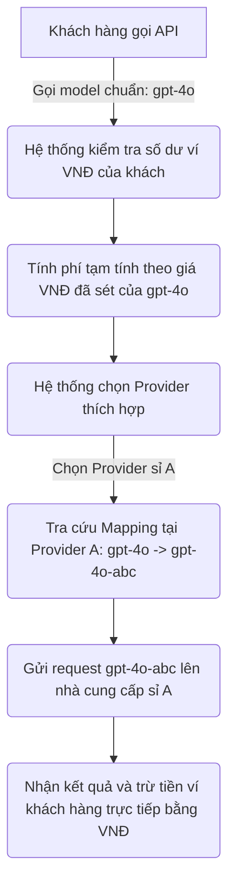

# [Quy Trình Mới - Tài Liệu 1] Quy Trình Thiết Lập Provider & Sét Giá Bán Lẻ Thuần VNĐ

Tài liệu này hướng dẫn chi tiết quy trình mới dành cho Admin để kết nối nhà cung cấp sỉ (Provider), đồng bộ danh sách model thật, thiết lập ánh xạ và cấu hình bảng giá bán lẻ trực tiếp bằng đơn vị tiền tệ VNĐ (không dùng tỷ giá trung gian hay điểm Quota).

---

## BƯỚC 1: THÊM PROVIDER MỚI (ADD PROVIDER)

Giao diện thêm nhà cung cấp đã được tối giản hóa triệt để, loại bỏ ô chọn "Loại nhà cung cấp" phức tạp. Tất cả các kết nối đều sử dụng chung chuẩn kết nối OpenAI.

1. Truy cập trang quản trị Admin -> **Nhà cung cấp (Providers)** -> Chọn **Thêm mới (Add)**.
2. Điền 3 thông tin kết nối cốt lõi:
   - **Tên nhà cung cấp**: Đặt tên gợi nhớ để phân biệt (Ví dụ: `Kho sỉ LiteRouter 1`, `Nguồn chính OpenAI`).
   - **Base URL**: Địa chỉ cổng API của bên sỉ (Ví dụ: `https://api.nhacungcap.com`).
   - **API Key (Mã khóa)**: Nhập Custom Key nhận được từ bên sỉ.
3. Nhấn **Lưu (Save)**.

---

## BƯỚC 2: ĐỒNG BỘ MODEL THẬT & ÁNH XẠ (MODEL MAPPING) TẠI CHỖ

Hệ thống hoàn toàn sạch sẽ, không chứa bất kỳ danh sách model gắn cứng nào trong mã nguồn Go. Danh sách model hoàn toàn được định nghĩa động từ thực tế.

1. Tại Provider vừa tạo, nhấn nút **Nạp Model (Fetch Models)**. 
   - Hệ thống sẽ gọi trực tiếp đến API của bên sỉ để tải về danh sách các model thật mà API Key đó hỗ trợ (Ví dụ: `gpt-4o-abc`, `claude-3-5-sonnet-gds`, `deepseek-chat`).
2. **Thiết lập Ánh xạ model (Model Mapping) ngay tại Provider**:
   - Nếu tên model từ bên sỉ chứa đuôi lạ hoặc quá phức tạp, bạn hãy ánh xạ nó về tên chuẩn mà bạn muốn bán cho khách hàng.
   - *Ví dụ cấu hình Mapping tại Provider:*
     ```json
     {
       "gpt-4o-abc": "gpt-4o",
       "claude-3-5-sonnet-gds": "claude-3-5-sonnet",
       "deepseek-chat": "deepseek-chat"
     }
     ```
   - Nhấn **Lưu cấu hình**.

> [!NOTE]
> **Quy tắc quản lý Model chuẩn**: 
> Trang quản trị Model chính của hệ thống và bảng giá hiển thị cho khách hàng sẽ **chỉ hiển thị các model sau khi đã được mapping chuẩn** (như `gpt-4o`, `claude-3-5-sonnet`). Các tên model gốc rườm rà phía nhà cung cấp sẽ được ẩn đi hoàn toàn để tránh rối mắt.

---

## BƯỚC 3: SÉT GIÁ BÁN LẺ THUẦN VNĐ (VND PRICING)

Hệ thống đã loại bỏ hoàn toàn các tỷ giá quy đổi USD/Quota trung gian phức tạp và Nhân dân tệ. Toàn bộ tiền tệ trong ví khách hàng và bảng giá cấu hình đều sử dụng đơn vị **VNĐ gốc (1 điểm = 1 VNĐ)**.

1. Truy cập mục **Quản lý giá (Pricing)**. Hệ thống sẽ tự động liệt kê đúng các model chuẩn đã được mapping ở Bước 2.
2. Với mỗi model, Admin nhập trực tiếp số tiền VNĐ mong muốn bán lẻ cho khách hàng:
   - **Giá đầu vào (Input) trên 1 triệu tokens (VNĐ)**:
     - *Ví dụ:* Bạn muốn bán `gpt-4o` với giá 50.000 đ / 1 triệu tokens đầu vào. Bạn chỉ cần nhập số: `50000`.
   - **Giá đầu ra (Output) trên 1 triệu tokens (VNĐ)**:
     - *Ví dụ:* Bạn muốn bán `gpt-4o` with giá 200.000 đ / 1 triệu tokens đầu ra. Bạn chỉ cần nhập số: `200000`.
   - **Giá cố định trên mỗi lượt gọi (VNĐ) - (Tùy chọn)**:
     - Thích hợp cho model vẽ tranh hoặc model đặc biệt tính phí phẳng.
     - *Ví dụ:* Bạn muốn thu 1.500 đ cho mỗi lượt gọi thành công. Bạn chỉ cần nhập số: `1500` vào ô Giá cố định.
3. Nhấn **Lưu bảng giá**.

---

## BẢN ĐỒ DỰ PHÒNG KHI CÓ CUỘC GỌI API (RELAY FLOW)

Khi khách hàng của bạn gửi một yêu cầu API:

- Số dư ví của khách hàng hiển thị trên Web khớp 100% với số tiền thực tế họ nạp bằng chuyển khoản ngân hàng Việt Nam.
- Quá trình đối soát doanh thu của Admin trở nên vô cùng rõ ràng và minh bạch.
